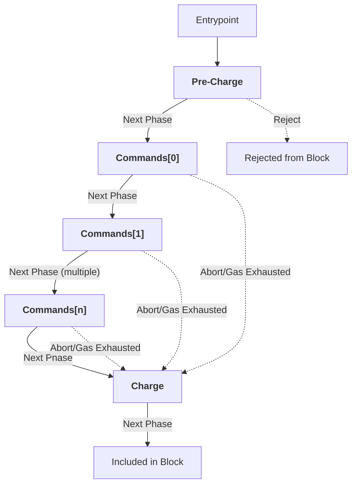

# Runtime (V1)

The Runtime is the component in the ParallelChain protocol which executes transactions. 

The primary interface that the runtime provides to the other components of the ParallelChain protocol is a function called the **Transition Function** that deterministically executes transactions. Execution of the transition function proceeds through three phases: Pre-Charge, Commands, and Charge. The sequence flow of the pre-charge and charge phases are common to all transactions, while the sequence flow of the commands phase varies according to the composition of a transaction's vector of commands. Besides specifying the execution of the transition function, this chapter also specifies the variants of the [Commands enum](Blockchain.md#Transaction) introduced in the Blockchain chapter.

This chapter is organized into four sections:
1. [Transition function (V1)](#transition-function-(v1)) specifies the *interface* of the transition function, i.e., its input parameters and output parameters.
2. [Execution model of the transition function](#execution-model-of-the-transition-function) introduces the concepts that will be used in the latter two sections to specify the *execution* of the transition function.
3. [Common phases](#common-phases) specifies the sequence flow of executing the two "phases" (pre-charge and charge) that are common in the execution of all transactions.
4. [Commands](#commands) specifies the variants of the commands enum and the sequence flow of transaction execution through the commands phase.

## Transition Function (V1)

The Transition Function is a pure function that takes in three input parameters and returns two output parameters. The signature of the transition function can be represented symbolically as follows:

**```transition(cws, txn, bctx) -> (nws, rcp)```**

The input parameters and return values of the transition function are specified in the following two subsections:

### Input parameters

|Input parameter|Type|Description|
|---|---|---|
|Transaction (`txn`)|Transaction (V1)|A transaction to be executed by the Runtime.|
|Current World State (`cws`)|World State (V1)|The world state just before the execution of the transaction, i.e., after sequentially executing every previous transaction.|
|Blockchain Context (`bctx`)|Blockchain Context (V1)|A set of information about the current contents of the Blockchain.|

#### Blockchain Context (V1)

Blockchain Context is a struct that contains a set of information about the current contents of the Blockchain, including the current block. 

This information can be used in the execution of a transaction, including in the execution of some commands. For example, some contract Calls may choose to use the timestamp of the current block to determine whether a pre-defined event has happened.

The fields of blockchain context are:

|Field|Type|Description|
|---|---|---|
|Block Height|`u64`|The height field of the current block, i.e., block that the transaction to be executed is being considered for inclusion in.|
|Base Fee Per Gas|`u64`|The base fee per gas field of the current block.|
|Timestamp|`u32`|The timestamp field of the current block.|
|Proposer Address|`PublicAddress`|The proposer address field of the current block.|
|Previous Block Hash|`Sha256Hash`|The previous block hash field of the current block.|
|Current View|`u64`|The current HotStuff-rs view number.|
|Number of Blocks Proposed|`Option<HashMap<PublicAddress, u32>>`|A mapping between the public addresses of the validators in the current validator set and the number of blocks they have proposed so far in the current epoch. This field is `Some` only if the Transaction being executed contains a singular Next Epoch command (i.e., if the current block is an [epoch boundary block](Blockchain.md#epoch)).|

### Output parameters

|Output  parameter|Type|Description|
|---|---|---|
|Next World State (`nws`)|World State (V1)|The world state after executing the transaction.|
|Receipt (`rcp`)|Receipt (V1)|A receipt summarizing the execution of the transaction.|

## Execution model of the transition function

This section introduces the terminology, symbols, and control flow concepts that we will use to specify the execution of the transition function. In particular:
1. [State variables](#state-variables) lists variables that the transition function keeps track of throughout the execution of a single transaction.
2. [Phases](#phases) describes the different ways execution can jump between *three* phases (pre-charge, commands, and charge), both in the normal ("happy path") case and in exceptional scenarios.
3. [Control flow](#control-flow) TODO.
4. [Gas counting (V1)](#gas-counting) specifies how Transition (V1) uses the gas formulas specified in the [Gas (V1)](Gas.md) chapter of the protocol to determine the gas used (computation and storage costs) of the execution of a transaction.
5. [Pseudocode](#pseudocode) describes the pseudocode that we will use in the [common phases](#common-phases) and [command](#command) sections of this chapter to specify the sequence flow of each phase of the execution of a transaction.

### State variables

The transition function keeps track of 10 state variables throughout the execution of a single transaction, *including* the previously specified input parameters and return values. Besides the input parameters and return values, these variables are:

|Variable|Type|Description|Initial value|
|---|---|---|---|
|Command Index (`idx`)|`u32`|The index of the command currently being executed inside the transaction's vector of commands.|0|
|Logs (`logs`)|`Vec<Log>`|A growing list of the logs emitted by the execution of the current *command*.|`Vec::new()`|
|Return Value (`rval`)|`Vec<u8>`|The return value of the current *command*.|`Vec::new()`|
|Gas Counter (`gc`)|`u64`|The amount of gas used so far in the execution of the current *transaction*|$G_{txincl}(txn)$|
|Starting Gas (`sg`)|`u64`|The value of the Gas Counter at the beginning of the execution of the current *command*|$G_{txincl}(txn)$|

### Phases

The execution of a transaction in the transition function proceeds in three phases. Each phase consists of a specific sequence of steps, each doing an operation like mutating a state variable or accessing the world state.

The three phases and what each phase does at a high level are:
1. **Pre-charge phase**: this phase makes simple checks to ensure that the transaction can be included in the block, updates the signer's nonce, and then tentatively charges the *maximum* gas fee that the transaction may use in its execution (as determined by the signer-specified gas limit).
2. **Commands phase**: this phase executes the sequence of commands included in the transaction. This phase proceeds in iterations, with each iteration corresponding to one command.
3. **Charge phase**: this phase *refunds* the amount of gas tentatively charged in the pre-charge step that was not used in the transaction's execution. It then transfers the priority fee to the proposer, and $G_{treasurybasefee}$% of the base fee to the treasury account.

### Control flow

Execution can transition from one phase to another in a few different ways. We refer to these collectively as the “control flow” of transaction execution. 

The below flowchart depicts every possible way that the control flow could proceed. In the flowchart:
- Boxes containing bolded text represent phases.
- Solid lines with text represent transitions from one phase to another in the "happy path"
- Dotted lines with text represent transitions from one phase to another outside the happy path.
- Boxes containing non-bolded text represent the entrypoint of the control flow, as well as its exit-points (i.e., whether the transaction can be included in a block, or it must be rejected).



As can be seen in the flowchart, there are *four* ways control flow can transition between one phase to another: Reject, Next Phase, Abort, and Gas Exhausted. These are specified in the following subsections.

#### Reject

Reject is triggered if the transaction does not satisfy any of the checks made in the pre-charge phase. This causes execution to end immediately, and for the transaction to be excluded from the block.

#### Next Phase

Next Phase is triggered after an iteration of the commands phase is fully executed. The following sequence of events occur when next phase is triggered:
1. A command receipt is appended to the `rcp` state variable containing *Operation Successful* in the command receipt's exit status field, the current value of `log` in its Log field, the current value of `gc - sg` in its Gas Used field, and `rval` in its Return Value field.
2. `logs` and `rval` is set to their initial values.
3. `sg` is set to `gc`.

Control flow then passes to the next iteration of the commands phase (if there is a next iteration), or to the charge phase (otherwise).

#### Abort

Abort is triggered if some command-specific error occurs during an iteration of the commands phase (e.g., if a [Set Pool Settings](#set-pool-settings) command tries to set the commission rate of a pool to be greater than 100%). The following sequence of events occur when abort is triggered:
1. All changes to `nws` done in the current and preceding *commands* are reverted without increasing `gc` (note that the changes done in the pre-charge phase are *not* reverted).
2. A command receipt is appended to the `rcp` state variable containing *Operation Failed* in the command receipt's exit status field, the current value of `log` in its Log field, the current value of `gc - sg` in its Gas Used field, and `rval` in its Return Value field.

Execution then passes directly to the charge phase.

#### Gas Exhausted

Gas Exhausted is triggered automatically upon `gc` exceeding the transaction’s gas limit. The following sequence of events occur when gas exhausted is triggered:
1. All changes to `nws` done in the current and preceding *commands* are reverted without increasing `gc` (note that the changes done in the pre-charge phase are *not* reverted).
2. A command receipt is appended to the `rcp` state variable containing *Gas Exhausted* in the command receipt's exit status field, the current value of `log` in its Log field, the current value of `gc - sg` in its Gas Used field, and `rval` in its Return Value field.

Control flow then passes directly to the charge phase.

### Gas counting

Gas counting is the mechanism by which the runtime keeps track of the computational and storage cost of executing a transaction. The cost of the gas used by a transaction is then charged from the balance of the transaction's signer in the pre-charge and charge phases.

The runtime performs gas counting by adjusting the `gc` state variable (usually by increasing it). `gc` is adjusted *before* each step *in the commands phase* that involves operations in any of the [5 categories](Gas.md) listed in the gas chapter of the ParallelChain protocol. 

Transition (V1) uses the gas formulas specified in [Gas (V1)](Gas.md) to deterministically compute the gas used (computation and storage costs) by each step.

The cost of storing a minimal size command receipt for each of a transaction's commands is also already covered by the transaction inclusion cost. In exceptional circumstances, a transaction's receipt may contain less command receipts than there are commands. The cost of storing the excess command receipts in these cases are *not* refunded.

The cost of storing the return value is charged on setting `rval`, the cost of storing a log is charged on appending a log into `logs`.

### Sequence flow pseudocode

Throughout this document, we specify sequence flows using a Rust-like pseudocode.

The pseudocode snippets have available in their environment the variables introduced in [state variables](#state-variables) and named constants and formulas introduced throughout the protocol of the form “C_name”. The snippets specifying the commands phase for each command have available the additional variable `input`, which is the specific command’s input. 

`ws` is treated like a struct with a field `nas`, which is the network account’s storage. `nas` is itself a struct with fields corresponding to the fields listed in the [world state specification](World%20State.md#network-account-storage-data-types). The `previous_validator_set`, `current_validator_set` and `next_validator_set` fields in particular are are Index Heaps, and operations on them are available as methods in Rust syntax.

## Common phases 

### Pre-charge

The pre-charge phase does simple checks to ensure that a transaction may be included in a block, updates the signer's nonce, and then charges the *maximum* gas fee that the transaction may use throughout its execution. If the transaction ends up using less than the maximum, the difference is refunded in the charge step.

Steps:
```rust
if txn.max_base_fee_per_gas < bctx.base_fee_per_gas
    || txn.nonce != ws[txn.signer].nonce 
    || txn.gas_limit < G_txincl(txn)
    || !txn.signature.is_correct() {
    cancel!()
}

let max_charge = txn.gas_limit * (bctx.base_fee_per_gas + txn.priority_fee_per_gas);

if ws[txn.signer].balance < max_charge {
    cancel!()
}

ws[txn.signer].balance -= max_charge;
ws[txn.signer].nonce += 1;
```

### Charge

The charge phase refunds the amount of gas charged in the pre-charge step that wasn't used in the transaction's execution. It then transfers the priority fee to the proposer, and $G_{treasurybasefee}$ % of the base fee to the treasury.

Steps:
```rust
ws[txn.signer].balance += (txn.gas_limit - gc) * (bctx.base_fee_per_gas + txn.priority_fee_per_gas);
ws[bctx.proposer].balance += gc * txn.priority_fee_per_gas;
ws[W_treasury].balance += gc * bctx.base_fee_per_gas * G_treasurybasefee;
```

## Commands 

There are currently 13 different kinds of commands, each corresponding to a variant of the command enum type. These are further divided into three categories: account commands, staking commands, and protocol commands. Most commands take inputs, which are part of the command type as the fields of its corresponding variant. These are listed in the second column of the following tables.

This section lists and briefly describes each kind of command, beginning with those in the account commands category and ending with protocol commands. Higher-level context about staking and proof of stake in the ParallelChain protocol is available in the world state document.

### Account commands

#### Transfer

|**Variant**|**Name**|**Input**|**Description**|
|---|---|---|---|
|0|Transfer|<ul> <li>Recipient (`PublicAddress`)</li> <li>Amount (`u64`)</li>|Transfer an amount from the signer's balance to the recipient's balance.|

```rust
if ws[signer].balance < input.amount {
    abort!()
}

ws[txn.signer].balance -= input.amount;
ws[input.recipient].balance += input.amount;
```

#### Deploy

|**Variant**|**Name**|**Input**|**Description**|
|---|---|---|---|
|1|Deploy|<ul> <li>Contract (`Vec<u8>`)</li> <li>CBI version (`u32`)</li> </ul>|Deploy a contract that implements a given CBI version.|

```rust
let contract_addr = C_address(txn.signer, txn.nonce);
if let Ok(_) = instantiate(input.contract, input.cbi_version) {
    ws[contract_addr].contract = input.contract;
    ws[contract_addr].cbi_version = input.cbi_version;
}
```

#### Call

|**Variant**|**Name**|**Input**|**Description**|
|---|---|---|---|
|2|Call|<ul> <li>Target (`PublicAddress`)</li> <li>method (`String`)</li> <li>arguments (`Option<Vec<Vec<u8>>>`)</li> <li>amount (`Option<u64>`)</li></ul>|Call a contract with the given method and arguments, optionally transferring some tokens.|

```rust
let contract = ws[input.target].contract;
if contract.is_none() {
    abort!()
}

let cbi_version = ws[target].cbi_version;
if let Ok(instance) = instantiate(contract, cbi_version) {
    call(instance.action, cbi_version);
} else {
    unreachable!()
}
```

### Staking commands

The actual amount of tokens that could be withdrawn, staked, or unstaked by the final three kinds of commands depends on timing and ordering, factors that users do not have precise control over. For example, the number of tokens that can be withdrawn from a deposit can change significantly between epochs as the deposit's [bonded balance](Blockchain.md#delegated-proof-of-stake) decreases, or increases. 

Therefore, these commands accept as input a "max amount" instead of a precise amount. These commands try to withdraw, stake, or unstake as close to the maximum amount as possible, and inform the precise amount in its return value.

#### Create Pool 

|**Variant**|**Name**|**Input**|**Description**|
|---|---|---|---|
|3|Create pool|<ul> <li>Commission rate (`u8`)</li> </ul>|Create a new pool with the signer as the operator an which charges a given commission rate on the validator rewards of delegated stakes.|

```rust
let operator = txn.signer;

if input.commission_rate > 100 {
    abort!()
}

if ws.nas.pools.contains(operator) {
    abort!()
}

ws.nas.pools[operator] = Pool {
    operator,
    commission_rate: input.commmission_rate,
    power: 0,
    self_stake: None,
    delegated_stakes: IndexHeap::initialize(),
};
```

#### Set Pool Settings

|**Variant**|**Name**|**Input**|**Description**|
|---|---|---|---|
|4|Set pool settings|<ul> <li>Commission rate (`u8`)</li> </ul>|Set the commission rate of an existing pool, operated by the signer.|

```rust
let operator = txn.signer;

if input.commission_rate > 100 {
    abort!()
}

if !ws.nas.pools.contains(operator) {
    abort!()
}

if ws.nas.pools[operator].commission_rate == input.commission_rate {
    abort!()
}


ws.nas.pools[operator].commission_rate = input.commission_rate;
```

#### Delete Pool

|**Variant**|**Name**|**Input**|**Description**|
|---|---|---|---|
|5|Delete pool|None|Delete an existing pool, also deleting all of its existing stakes.|

```rust
let operator = txn.signer;

if !ws.nas.pools.contains(operator) {
    abort!()
}

ws.nas.next_validator_set.remove(operator);

ws.nas.pools[operator] = "";
```

#### Create Deposit

|**Variant**|**Name**|**Input**|**Description**|
|---|---|---|---|
|6|Create Deposit|<ul> <li>Operator (`PublicAddress`)</li> <li>Balance (`u64`)</li> <li>Auto stake rewards? (`bool`)</li> </ul>|Create a deposit that targets a given operator, with the given balance, and which may or may not automatically stake the validator rewards that it receives.|

```rust
let owner = txn.signer;

if !ws.nas.pools.contains(input.operator)
    || ws.nas.deposits.contains((input.operator, owner))
    || ws[owner].balance < input.balance {
    abort!()
}

ws[owner].balance -= input.balance;

ws.nas.deposits[(input.operator, input.owner)] = Deposit {
    balance: input.balance,
    auto_stake_rewards: input.auto_stake_rewards,
}
```

#### Set Deposit Settings

|**Variant**|**Name**|**Input**|**Description**|
|---|---|---|---|
|7|Set deposit settings|<ul> <li>Operator (`PublicAddress`)</li> <li>Auto stake rewards? (`bool`)</li> </ul>|Set whether a given deposit automatically stakes validator rewards.|

```rust
let owner = txn.signer;

if !ws.nas.deposits.contains((input.operator, owner)) {
    abort!()
}

if ws.nas.deposits[(input.operator, owner)].auto_stake_rewards == input.auto_stake_rewards {
    abort!()
}


ws.nas.deposits[(input.operator, owner)].auto_stake_rewards = input.auto_stake_rewards;
```

#### Top-Up Deposit

|**Variant**|**Name**|**Input**|**Description**|
|---|---|---|---|
|8|Top up deposit|<ul> <li>Operator (`PublicAddress`)</li> <li>Balance (`u64`)</li> </ul>|Transfer more tokens into an existing deposit.|

```rust
let owner = txn.signer;

if !ws.nas.deposits.contains((input.operator, owner))
    || ws[owner].balance < input.amount {
    abort!()
}

ws[owner].balance -= input.amount;
ws.nas.deposits[(operator, owner)].amount += input.amount;
```

#### Withdraw Deposit

|**Variant**|**Name**|**Input**|**Description**|
|---|---|---|---|
|9|Withdraw Deposit|<ul> <li>Operator (`PublicAdddress`)</li> <li>Max amount (`u64`)</li> </ul>|Try to withdraw a given amount from a deposit into the signer's balance.|

```rust
let owner = txn.signer;

if !ws.nas.deposits.contains((input.operator, owner)) {
    abort!()
}

// Compute the locked power: the max of the deposit's stake power in the previous epoch and the current epoch. 
let prev_epoch_power = ws.nas.previous_validator_set.get(input.operator).map_or(0, |pool| pool.get_stake(owner).map_or(0, |stake| stake.power)); 
let curr_epoch_power = ws.nas.current_validator_set.get(input.operator).map_or(0, |pool| pool.get_stake(owner).map_or(0, |stake| stake.power));
let locked_power = max(prev_epoch_power, curr_epoch_power);

// Calculate the new deposit balance. If it is unchanged, abort.
let curr_deposit_balance = ws.nas.deposits[(input.operator, owner)].balance;
let withdrawal_amount = min(input.max_amount, curr_deposit_balance - locked_power);
let new_deposit_balance = curr_deposit_balance - withdrawal_amount;
if curr_deposit_balance == new_deposit_balance {
    abort!()
}

// If the new deposit balance is 0, delete the deposit.
if new_deposit_balance == 0 {
    ws.nas.deposits[(operator, owner)].balance = None; 
    ws.nas.deposits[(operator, owner)].auto_stake_rewards = None;
} else {
    ws.nas.deposits[(operator, owner)].balance = new_deposit_balance;
}

// If the new deposit balance is less than its tentative stake, change the latter's power to new deposit balance.
if let Some(pool) = ws.nas.pools.get(input.operator) {
    if let Some(stake) = pool.get_stake(owner) {
        stake.change_power(curr_deposit_balance);
    }
}

// Return the amount that is withdrawn.
rval = withdrawal_amount;
```

#### Stake Deposit

|**Variant**|**Name**|**Input**|**Description**|
|---|---|---|---|
|10|Stake|<ul> <li>Operator (`PublicAddress`)</li> <li>Max amount (`u64`)</li> </ul>|Try to stake a given amount from a deposit.|

```rust
let owner = txn.signer;

if !ws.nas.deposits.contains((input.operator, owner)) { 
    abort!()
}

if !ws.nas.pools.contains(input.operator) {
    abort!()
}

let balance = ws.nas.deposits[(input.operator, owner)].balance;

let amount_staked = if let Some(stake) = ws.nas.pools[input.operator].get_stake(owner) {
    let existing_power = stake.power;
    let desired_power = existing_power + input.max_amount;
    let new_power = min(desired_power, balance);
    if new_power == existing_power {
	    abort!()        
    }

    stake.change_power(new_power);
    
    new_power - existing_power
} else {
    let power = min(input.max_amount, balance);
    
    let inserted = ws.nas.pools[input.operator].insert_stake(owner, power);
    if !inserted {
        abort!()
    }
    
    power
}

// Return the amount staked.
rval = amount_staked;
```

#### Unstake Deposit

|**Variant**|**Name**|**Input**|**Description**|
|---|---|---|---|
|11|Unstake|<ul> <li>Operator (`PublicAddress`)</li> <li>Max amount (`u64`)</li> </ul>|Try to reduce a deposit's stake by a given amount.|

```rust
let owner = txn.signer;

if !ws.nas.deposits.contains((operator, owner)) {
    abort!()
}

if !ws.nas.pools.contains(operator) {
    abort!()
}

if let Some(stake) = ws.nas.pools[operator].get_stake(owner) {
    let existing_power = stake.power;
    let new_power = stake.power.saturating_sub(max_amount);

    stake.change_power(new_power);

    let amount_unstaked = existing_power - new_power;

    // Return the amount unstaked.
    rval = amount_unstaked;
} else {
    abort!()
}
```

### Protocol commands

|**Variant**|**Name**|**Input**|**Description**|
|---|---|---|---|
|12|Next epoch|None|Reward the current epoch's validators, and confirm the next epoch's validator set.|

#### Next Epoch

```rust
// Iterate through pools in the current validator set.
for pool in nas.current_validator_set {
    let pool_reward = R_poolreward(epoch, pools.len(), pool.power, num_blocks_proposed(n, pool.operator));
    
    // Reward the delegated stakes in the pool. 
    let mut total_commission_fee = 0;
    for stake in pool.delegated_stakes {
        let gross_stake_reward = R_grsstakereward(pool_reward, stake.power, pool.power);
        let commission_fee = R_commissionfee(pool.commission_rate, pool_reward, stake.power, pool.power);
        total_commission_fee += commission_fee;

        let net_stake_reward = gross_stake_reward - commission_fee;
 
        // Deposit the delegator's reward.
        let deposit = nas.deposits[(stake.operator, stake.owner)];
        deposit.balance += net_stake_reward;
        
        // (Auto) stake the delegator's reward. 
        if deposit.auto_stake_reward {
            if let Some(next_stake) = nas.pools.get_stake(stake.owner) {
                next_stake.change_power(next_stake.balance + net_stake_reward);
            } else {
                nas.next_validator_set.insert_stake(stake.owner, net_stake_reward);
            }
        }
    }

    // Reward the pool operator.
    let operator_stake_reward = R_grsstakereward(pool_reward, stake.power, pool.power) + total_commission_fee;

    if let Some(deposit) = nas.deposits.get((stake.operator, stake.owner)) {
        deposit.balance += operator_stake_reward;

        if deposit.auto_stake_reward {
            if let Some(next_stake) = nas.pools.get_stake(stake.owner) {
                next_stake.change_power(next_stake.balance + operator_stake_reward);
            } else {
                nas.next_validator_set.insert_stake(stake.owner, net_stake_reward);
            }
        }
    } else {
        ws.nas.deposits[(stake.operator, stake.owner)] = Deposit {
            balance: operator_stake_reward,
            auto_stake_rewards: false,
        }
    }
}

// Replace previous validator set with current validator set.
ws.nas.previous_validator_set = ws.nas.current_validator_set;

// Replace current validator set with next validator set.
ws.nas.current_validator_set = ws.nas.next_validator_set;

// Increment current epoch.
ws.nas.current_epoch += 1;
```

The above sequence flow invokes formulas that collectively decide how many tokens are rewarded to each particular stake at the end of an epoch.

The intended result of these formulas is for the reward rate to reduce gradually from around 8.0% per annum in the first year of the blockchain's history, to 1.5% per annum by year 10:

**`R_poolreward(n, v, p, rb)`** is the number of tokens rewarded at the end of epoch $n$--which had a total of $v$ validators--to a pool with $p$ power and which had proposed $rb$ blocks in the epoch:

$$
R_{poolreward}(n, v, rb, p) = p \times \begin{dcases}
\frac{835 \times E_{ireduct}(n) \times rb}{365 \times E_{expblocks}(v) \times 100000000} &\text{ if } n < 3650 \text{ and } rb < E_{expblocks}(v), \\
\frac{835 \times E_{ireduct}(n)}{365 \times 100000000} &\text{ if } n < 3650 \text{ and } rb \ge E_{expblocks}(v), \\
\frac{15 \times rb}{365 \times E_{expblocks}(v)  \times 1000}&\text{ if } n \ge 3650 \text{ and } rb < E_{expblocks}(v), \\
\frac{15}{365 \times 1000} &\text{ if } n \ge 3650 \text{ and } rb \ge E_{expblocks}(v), \\
\end{dcases}
$$

Where $E_{expblocks}(v) = B_{epoch}/v$, and $E_{ireduct}$ is a sequence of pre-computed values, specified in pchain-formulas (WIP).

**`R_grsstakereward(pr, sp, pp)`** is the number of tokens in a pool reward $pr$ rewarded to a particular stake with power $sp$ included in a total pool power of $pp$:

$$
R_{grsstakereward}(pr, sp, pp) = \frac{pr \times sp}{pp}
$$

**`R_commissionfee(r, pr, sp, pp)`** is the number of tokens in a delegated stake reward paid to the pool's operator if the commission rate is $r$, the pool reward is $pr$, the stake's power is $sp$, and the total pool power is $pp$:

$$
R_{commissionfee}(r, pr, sp, pp) = \frac{r \times pr}{pp \times 100}
$$

**`num_blocks_proposed(n, op)`** is the number of blocks in the range $[n\times B_{epoch}, (n+1)\times B_{epoch})$ that were proposed by operator $op$. 
