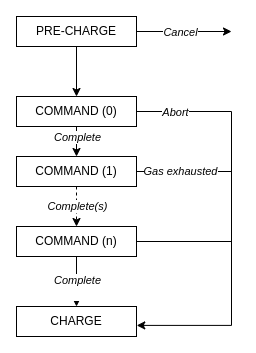

# Runtime

|Revision no.|
|---|
|0|

The runtime is the component in the ParallelChain protocol which executes transactions.

At a high level, the runtime is an impure function that takes in the world state ($ws$), a block context ($bctx$), and a transaction ($txn$) as inputs, mutates the world state, and returns a receipt ($rcp$) as output:

Runtime: $(ws, bctx, txn) \rightarrow rcp$.

The run function proceeds in three phases, which are called “pre-charge”, “work”, and “charge”. The first and last phases are common to all transactions, while the work phase is specific to the sequence of commands in a particular transaction. The execution of commands is where transactions become really useful, so the bulk of this document is dedicated to specifying the work phase. 

This document specifies the runtime in four sections:
1. The [first section](#commands) lists and describes all of the available commands at a high level, including specifying the command data type, which features in the transaction type.
2. The [second section](#execution-model) sets up the basic terminology, symbols, and control flow concepts that we will use to specify the sequence flow of transaction execution.
3. The [third section](#common-phases) specifies the sequence flow of transaction execution through pre-charge and charge phases.
4. The [fourth section](#work-phase) specifies the sequence flow of transaction execution through the work phase.

## Commands

There are currently 13 different kinds of commands, each corresponding to a variant of the command enum type. These are further divided into three categories: account commands, staking commands, and protocol commands. Most commands take inputs, which are part of the command type as the fields of its corresponding variant. These are listed in the second column of the following tables.

This section lists and briefly describes each kind of command, beginning with those in the account commands category and ending with protocol commands. Higher-level context about staking and proof of stake in the ParallelChain protocol is available in the world state document.

### Account commands

|**Name**|**Input**|**Description**|
|---|---|---|
|Transfer|<ul> <li>Recipient (`PublicAddress`)</li> <li>Amount (`u64`)</li>|Transfer an amount from the signer's balance to the recipient's balance.|
|Deploy|<ul> <li>Contract (`Vec<u8>`)</li> <li>CBI version (`u32`)</li> </ul>|Deploy a contract that implements a given CBI version.|
|Call|<ul> <li>Target (`PublicAddress`)</li> <li>method (`String`)</li> <li>arguments (`Option<Vec<Vec<u8>>>`)</li> <li>amount (`Option<u64>`)</li></ul>|Call a contract with the given method and arguments, optionally transferring some tokens.|

### Staking commands

|**Name**|**Input**|**Description**|
|---|---|---|
|Create pool|<ul> <li>Commission rate (`u8`)</li> </ul>|Create a new pool with the signer as the operator an which charges a given commission rate on the validator rewards of delegated stakes.|
|Set pool settings|<ul> <li>Commission rate (`u8`)</li> </ul>|Set the commission rate of an existing pool, operated by the signer.|
|Delete pool|None|Delete an existing pool, also deleting all of its existing stakes.|
|Create Deposit|<ul> <li>Operator (`PublicAddress`)</li> <li>Balance (`u64`)</li> <li>Auto stake rewards? (`bool`)</li> </ul>|Create a deposit that targets a given operator, with the given balance, and which may or may not automatically stake the validator rewards that it receives.|
|Top up deposit|<ul> <li>Operator (`PublicAddress`)</li> <li>Balance (`u64`)</li> </ul>|Transfer more tokens into an existing deposit.|
|Set deposit settings|<ul> <li>Operator (`PublicAddress`)</li> <li>Auto stake rewards? (`bool`)</li> </ul>|Set whether a given deposit automatically stakes validator rewards.|
|Withdraw Deposit|<ul> <li>Operator (`PublicAdddress`)</li> <li>Max amount (`u64`)</li> </ul>|Try to withdraw a given amount from a deposit into the signer's balance.|
|Stake|<ul> <li>Operator (`PublicAddress`)</li> <li>Max amount (`u64`)</li> </ul>|Try to stake a given amount from a deposit.|
|Unstake|<ul> <li>Operator (`PublicAddress`)</li> <li>Max amount (`u64`)</li> </ul>|Try to reduce a deposit's stake by a given amount.|

The actual amount of tokens that could be withdrawn, staked, or unstaked by the final three kinds of commands depends on timing and ordering, factors that users do not have precise control over. For example, the number of tokens that can be withdrawn can change significantly between epochs, as a deposit's [bonded balance](World%20State.md#delegated-proof-of-stake) decreases, or increases. 

Therefore, these commands accept as input a "max amount" instead of a precise amount. These commands try to withdraw, stake, or unstake as close to the maximum amount as possible, and inform the precise amount in its return value.

### Protocol commands

|Name|Input|Description|
|---|---|---|
|Next epoch|None|Reward the current epoch's validators, and confirm the next epoch's validator set.|

## Execution model

As explained at the beginning of this document, the runtime is modelled as an impure function that proceeds in three phases. This section gives a clearer picture of this model. It is organized into four subsections:
1. The [first subsection](#state-variables) lists variables that we keep track of through a transaction execution, including inputs and output, and internal variables.
2. The [second subsection](#control-flow) describes how execution jumps between the three phases (both in the normal case, and in exceptional cases).
3. The [third subsection](#gas-counting) specifies gas counting.
4. The [fourth subsection](#sequence-flow-pseudocode) describes the pseudocode that we use throuhgout this document to specify sequence flows.

### State variables 

Transaction execution takes three inputs:

|Name|Type|Description|
|---|---|---|
|$txn$|`Transaction`|The transaction to be executed.|
|$ws$|N/A|The world state after executing all previous transactions.|
|$bctx$|N/A|The fields of the block which the transaction is being considered for inclusion into that are available before execution. This includes block height, justify, chain ID, proposer, timestamp, and base fee per gas.| 

And produces one output:

|Name|Type|Description|Initial value|
|---|---|---|---|
|$rcp$|`Vec<CommandReceipt>`|The receipt created by executing the transaction.|`Vec::new()`|

Besides the three inputs and the one output, we also keep track of 4 additional state variables throughout transaction execution:

|Name|Type|Description|Initial value|
|---|---|---|---|
|$logs$|`Vec<Log>`|The logs created in the execution of a command.|`Vec::new()`|
|$rval$|`Vec<u8>`|The return value of a command.|`Vec::new()`|
|$gc$|`u64`|The amount of gas used so far.|$G_{txincl}(txn)$|
|$sg$|`u64`|The value of gas used at the start of an iteration of the work phase|$G_{txincl}(txn)$|

The latter two state variables are significant for [gas counting](#gas-counting).

### Control flow

Execution can transition from one phase to another in a few different ways. We refer to these collectively as the “control flow” of transaction execution, and specify them in this subsection.



The diagram above depicts the control flow. The left side of the diagram depicts the normal sequence of transitions in an execution. The right side of the diagram depicts exceptional transitions. All transitions (except the transition from pre-charge to the first iteration of the work phase) are triggered by a named event, these are the names inset in the lines in the diagram. There are four kinds of events: *cancel*, *complete*, *abort*, and *gas exhausted*.

In the normal case, execution beings at the pre-charge phase, then transitions to the first iteration of the work phase after the pre-charge phase is fully executed, then transitions through each iteration of the work phase and onto the charge phase on *complete*s. If the transaction does not have any commands, execution passes directly from pre-charge to charge.

In exceptional cases, execution can be *cancel*led in the pre-charge phase, or jump directly to the charge phase on *abort* or *gas exhausted*.

**cancel** is triggered explicitly if the transaction does not satisfy one of the checks done in the pre-charge step. This causes execution to end immediately, and for the transaction to be excluded from the block.

**complete** is triggered explicitly after an iteration of the work phase is fully executed. This causes:
1. a command receipt to be created using the current values of $rval$ and $logs$, $gc - sg$ as the gas used, and with operation success as the exit code,
2. the command receipt to be appended to $rcp$,
3. $logs$ and $rval$ to be cleared.
4. $sg = gc$.
5. and execution to pass to the next iteration of the work phase if there is a next iteration, and to the charge phase otherwise.

**abort** is triggered explicitly if some command-specific invariant is violated during an iteration of the work phase. This causes:
1. all changes to the world state done in the current and preceding commands to be reverted, without changing $gc$,
2. a command receipt to be created using the current values of $rval$ and $logs$, $gc - sg$ as the gas used, and with operation failed as the exit code,
3. the command receipt to be appended to $rcp$,
4. and execution to pass to the charge phase.

**gas exhausted** is triggered automatically after $gc$ exceeds the transaction’s gas limit. This causes:
1. all changes to the world state done in the current and preceding commands to be reverted, without changing $gc$,
2. a command receipt to be created using the current values of $rval$ and $logs$, $gc - sg$ as the gas used, and with gas exhausted as the exit code,
3. the command receipt to be appended to $rcp$,
4. and execution to pass to the charge phase.

### Gas counting

$gc$ is adjusted *before* each step **in the work phase** that involves operations in one of the [5 categories](Gas.md#gas) listed in the gas specification. Execution in the pre-charge and charge steps are paid for in the [transaction inclusion cost](Gas.md#transaction-inclusion-cost), which is included in the initial value of $gc$. 

The cost of storing a minimal size command receipt for each of a transaction's commands is also already covered by the transaction inclusion cost. In exceptional circumstances, a transaction's receipt may contain less command receipts than there are commands. The cost of storing the excess command receipts in these cases are *not* refunded.

The cost of storing the return value is charged on setting $rval$, the cost of storing a log is charged on appending a log into $logs$.

### Sequence flow pseudocode

Throughout this document, we specify sequence flows using a Rust-like pseudocode.

The pseudocode snippets have available in their environment the variables introduced in [state variables](#state-variables) and named constants and formulas of the form “D_name”. The snippets specifying the work phase for each command have available the additional variable `input`, which is the specific command’s input. 

`ws` is treated like a struct with a field `nas`, which is the network account’s storage. `nas` is itself a struct with fields corresponding to the fields listed in the [world state specification](World%20State.md#network-account-storage-data-types). The `previous_validator_set`, `current_validator_set` and `next_validator_set` fields in particular are are Index Heaps, and operations on them are available as methods in Rust syntax.

## Common phases 

### Pre-charge

The pre-charge phase does simple checks to ensure that a transaction may be included in a block, updates the signer's nonce, and then charges the *maximum* gas fee that the transaction may use throughout its execution. If the transaction ends up using less than the maximum, the difference is refunded in the charge step.

Steps:
```rust
if txn.max_base_fee_per_gas < bctx.base_fee_per_gas
    || txn.nonce != ws[txn.signer].nonce 
    || txn.gas_limit < G_txincl(txn)
    || !txn.signature.is_correct() {
    cancel!()
}

let max_charge = txn.gas_limit * (bctx.base_fee_per_gas + txn.priority_fee_per_gas);

if ws[txn.signer].balance < max_charge {
    cancel!()
}

ws[txn.signer].balance -= max_charge;
ws[txn.signer].nonce += 1;
```

### Charge

The charge phase refunds the amount of gas charged in the pre-charge step that wasn't used in the transaction's execution. It then transfers the priority fee to the proposer, and $G_{treasurybasefee}$ % of the base fee to the treasury.

Steps:
```rust
ws[txn.signer].balance += (txn.gas_limit - gc) * (bctx.base_fee_per_gas + txn.priority_fee_per_gas);
ws[bctx.proposer].balance += gc * txn.priority_fee_per_gas;
ws[W_treasury].balance += gc * bctx.base_fee_per_gas * G_treasurybasefee;
```

## Work phase

### Account commands

#### Transfer

Steps:
```rust
if ws[signer].balance < input.amount {
    abort!()
}

ws[txn.signer].balance -= input.amount;
ws[input.recipient].balance += input.amount;
```

#### Deploy

Steps:
```rust
let contract_addr = sha256((txn.signer, txn.nonce));
if let Ok(_) = instantiate(input.contract, input.cbi_version) {
    ws[contract_addr].contract = input.contract;
    ws[contract_addr].cbi_version = input.cbi_version;
}
```

#### Call

Steps:
```rust
let contract = ws[input.target].contract;
if contract.is_none() {
    abort!()
}

let cbi_version = ws[target].cbi_version;
if let Ok(instance) = instantiate(contract, cbi_version) {
    call(instance.action, cbi_version);
} else {
    unreachable!()
}
```

### Staking commands

#### Create Pool 

```rust
let operator = txn.signer;

if input.commission_rate > 100 {
    abort!()
}

if ws.nas.pools.contains(operator) {
    abort!()
}

ws.nas.pools[operator] = Pool {
    operator,
    commission_rate: input.commmission_rate,
    power: 0,
    self_stake: None,
    delegated_stakes: IndexHeap::initialize(),
};
```

#### Set Pool Settings

```rust
let operator = txn.signer;

if input.commission_rate > 100 {
    abort!()
}

if !ws.nas.pools.contains(operator) {
    abort!()
}

if ws.nas.pools[operator].commission_rate == input.commission_rate {
    abort!()
}


ws.nas.pools[operator].commission_rate = input.commission_rate;
```

#### Delete Pool

```rust
let operator = txn.signer;

if !pools.contains(operator) {
    abort!()
}

ws.nas.next_validator_set.remove(operator);

ws.nas.pools[operator] = "";
```

#### Create Deposit

```rust
let owner = txn.signer;

if !pools.contains(input.operator)
    || deposits.contains((input.operator, owner))
    || ws[owner].balance < input.balance {
    abort!()
}

ws[owner].balance -= input.balance;

ws.nas.deposits[(input.operator, input.owner)].balance = input.balance;
ws.nas.deposits[(input.operator, input.owner)].auto_stake_rewards = input.auto_stake_rewards;
```

#### Set Deposit Settings

```rust
let owner = txn.signer;

if !ws.nas.deposits.contains((input.operator, owner)) {
    abort!()
}

if ws.nas.deposits[(input.operator, owner)].auto_stake_rewards == input.auto_stake_rewards {
    abort!()
}


ws.nas.deposits[(input.operator, owner)].auto_stake_rewards = input.auto_stake_rewards;
```

#### Top-Up Deposit

```rust
let owner = txn.signer;

if !ws.nas.deposits.contains((input.operator, owner))
    || ws[owner].balance < input.amount {
    abort!()
}

ws[owner].balance -= input.amount;
ws.nas.deposits[(operator, owner)].amount += input.amount;
```

#### Withdraw Deposit

```rust
let owner = txn.signer;

if !ws.nas.deposits.contains((input.operator, owner)) {
    abort!()
}

// Compute the locked power: the max of the deposit's stake power in the previous epoch and the current epoch. 
let prev_epoch_power = ws.nas.previous_validator_set.get(input.operator).map_or(0, |pool| pool.get_stake(owner).map_or(0, |stake| stake.power)); 
let curr_epoch_power = ws.nas.current_validator_set.get(input.operator).map_or(0, |pool| pool.get_stake(owner).map_or(0, |stake| stake.power));
let locked_power = max(prev_epoch_power, curr_epoch_power);

// Calculate the new deposit balance. If it is unchanged, abort.
let curr_deposit_balance = ws.nas.deposits[(input.operator, owner)].balance;
let withdrawal_amount = min(input.max_amount, curr_deposit_balance - locked_power);
let new_deposit_balance = curr_deposit_balance - withdrawal_amount;
if curr_deposit_balance == new_deposit_balance {
    abort!()
}

// If the new deposit balance is 0, delete the deposit.
if new_deposit_balance == 0 {
    ws.nas.deposits[(operator, owner)].balance = None; 
    ws.nas.deposits[(operator, owner)].auto_stake_rewards = None;
} else {
    ws.nas.deposits[(operator, owner)].balance = new_deposit_balance;
}

// If the new deposit balance is less than the stake in the next epoch, change the latter's power to new deposit balance.
if Some(stake) = ws.nas.pools[input.operator].get_stake(owner) {
    if stake.power < curr_deposit_balance {
        stake.change_power(curr_deposit_balance);
    } 
}

// Return the amount that is withdrawn.
rval = withdrawal_amount;
```

#### Stake Deposit

```rust
let owner = txn.signer;

if !ws.nas.deposits.contains((input.operator, owner)) { 
    abort!()
}

if !ws.nas.pools.contains(input.operator) {
    abort!()
}

let balance = ws.nas.deposits[(input.operator, owner)].balance;

let amount_staked = if let Some(stake) = ws.nas.pools[input.operator].get_stake(owner) {
    let existing_power = stake.power;
    let desired_power = existing_power + input.max_amount;
    let new_power = min(desired_power, balance);
    if new_power == existing_power {
	    abort!()        
    }

    stake.change_power(new_power);
    
    new_power - existing_power
} else {
    let power = min(input.max_amount, balance);
    
    let inserted = ws.nas.pools[input.operator].insert_stake(owner, power);
    if !inserted {
        abort!()
    }
    
    power
}

// Return the amount staked.
rval = amount_staked;
```

#### Unstake Deposit

```rust
let owner = txn.signer;

if !ws.nas.deposits.contains((operator, owner)) {
    abort!()
}

if !ws.nas.pools.contains(operator) {
    abort!()
}

if let Some(stake) = ws.nas.pools[operator].get_stake(owner) {
    let existing_power = stake.power;
    let new_power = stake.power.saturating_sub(max_amount);

    stake.change_power(new_power);

    let amount_unstaked = existing_power - new_power;

    // Return the amount unstaked.
    rval = amount_unstaked;
} else {
    abort!()
}
```

### Protocol commands

#### Next Epoch


```rust
let current_epoch = ws.nas.current_epoch;
let pending_to_auto_stake = [];

// 1. Reward each Stake in VS
for pool in ws.nas.current_validator_set {
    // 1.1 calculate total reward
    let pool_reward = calculate_pool_reward(current_epoch, pool.power, block_performance);

    // 1.2 Calculate total stakes of this pool
    let total_stakes = pool.operator_state + pool.delegated_stakes.iter().map(|stake| stake.power ).sum();

    let total_commission_fee = pool.delegated_stakes.iter().map(|stake| calculate_commission_fee(stake.power, total_stakes) ).sum();

    // 1.3 Distribute pool rewards to stakers
    let stakers_reward = pool.delegated_stakes.iter().map(|stake| {
        (stake.owner, calculate_stake_reward(stake.power, total_stakes))
    }).collect();

    for (staker, reward) in stakers_reward {
        if let Some(balance) = ws.nas.deposits[(pool.operator, staker)].balance {
            ws.nas.deposits[(pool.operator, staker)].balance = balance + reward;
        }

        if ws.nas.deposits[(pool.operator, staker)].auto_stake_rewards == Some(true) {
            pending_to_auto_stake.push((pool.operator, staker, reward));
        }
    }
    
    // 1.4 Reward Pool's own stakes 
    let pool_operator_total_reward = calculate_stake_reward(pool.operator_stake, total_stakes) + total_commission_fee;

    if let Some(balance) = ws.nas.deposits[(pool.operator, pool.operator)].balance {
        ws.nas.deposits[(pool.operator, pool.operator)].balance = balance + pool_operator_total_reward;
    } else {
        // create deposit if not exist
        ws.nas.deposits[(pool.operator, pool.operator)].balance = pool_operator_total_reward; 
        ws.nas.deposits[(pool.operator, pool.operator)].auto_stake_rewards = false;
    }

    if ws.nas.deposits[(pool.operator, pool.operator)].auto_stake_rewards == Some(true) {
        pending_to_auto_stake.push((pool.operator, pool.operator, pool_reward));
    }
}

// Auto Stake to NVP
for (operator, owner, increase_stake) in pending_to_auto_stake {
    let existing_pool_power = ws.nas.pools[operator].power.unwrap_or(0);
    let stake = ws.nas.pools[operator].get_stake(owner);
    stake.change_power(existing_pool_power + increase_stake); // also update the NVS
}

// 2. Replace PVS with VS
ws.nas.previous_validator_set.clear();
for pool in ws.nas.current_validator_set {
    ws.nas.previous_validator_set.push(pool);
}

// 3. Replace VS with NVS
ws.nas.current_validator_set.clear();
for pool in ws.nas.next_validator_set {
    ws.nas.current.validator_set.push(pool);
}

// 4. Bump up Current Epoch by 1.
ws.nas.current_epoch += 1;
```

Where the pool reward at epoch $n$ is given by multiplying the pool's total stake by $B_{epochissuance}(n)$.

$$
B_{epochissuance}(n) = \begin{dcases}
\frac{0.0835 \times 0.85^{\frac{n}{365}}}{365} &\text { if } n < 3650, \\
\frac{0.015}{365} &\text{ if } n \ge 3650, 
\end{dcases}
$$
